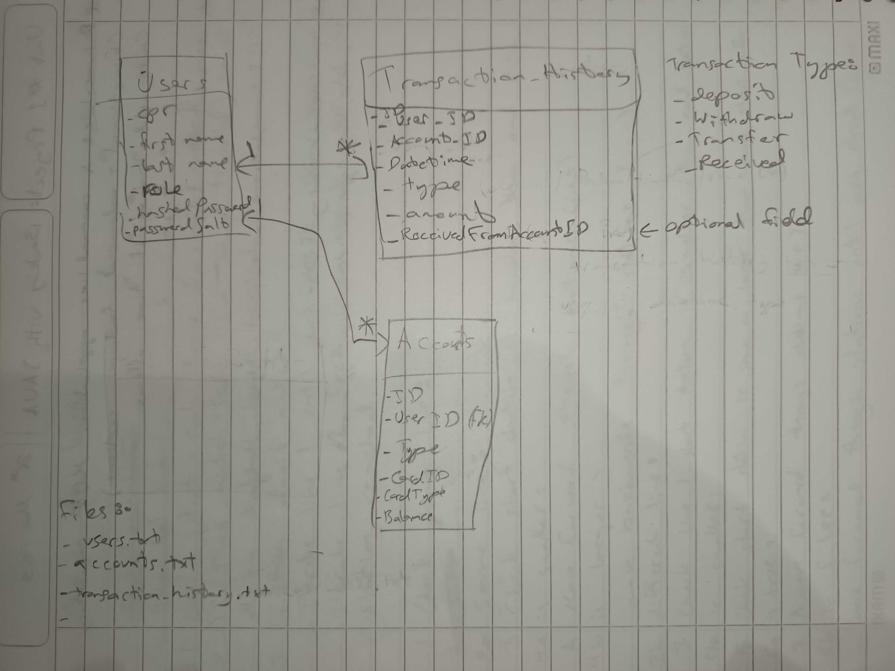

## CMD-Bank
Your bank at your fingertips.

## PROJECT BOARD
https://github.com/users/falansari/projects/11/views/1

## USER STORIES

- As a bank employee, I want to create accounts to onboard new customers.
- As a bank employee, I want to retrieve the information of an existing customer to serve them better.
- As a user, I should be able to interact securely with my bank accounts through a command-line interface. 
- As a user, I want to view a history of all transactions to track my spending and deposits.
- As a user, I want to filter my transaction history to only view transactions from certain days.
- As a user, I want to be able to set my own account's password to make it secure.
- As a user, I want to withdraw money from my account.
- As a user, I want to deposit money from my account.
- As a user, I want to transfer money between my accounts or to other bank account holders.
- As a user, I want to deposit money into my deactivated account to pay the overdraft fees and gain access back into the account.

## ENTITY RELATIONSHIP DIAGRAM (ERD)

## TECHNOLOGIES

- JAVA LTS v17
- IntelliJ IDEA Community Edition IDE
- Mentorship from Copilot (help get unstuck with bugs and logical errors).
- Pen and paper :)

## IMPLEMENTED FEATURES
- Data reading, filtering, writing and updating from text files. Each file is a database table sort of implementation.
- Exception handling with wrong input for all operations. Uses recursion technique to allow the user to keep trying again.
- Implemented ability to do as many operations as the user wants before deciding when to exit the system.
- **User Authentication System:**
  - Account Registration (by banker only)
  - Password encryption/decryption with SHA256 hashing and a unique auto generated salt per password.
  - User authentication: all bank operations are hidden behind a login screen.
  - Password reset: Banker can reset another user's password to default password (user's CPR), customer can change their password to meet security standards (including banker for their account).
  - Password complexity enforcement with: has to be at least 8 characters, must be a mix of letters, numbers and symbols.
  - Login Fraud Detection: If there are 3 failed login attempts lock the account for 1 min, before trying again with the login information.
- **Bank Account System:**
  - Debit card support for mastercard, mastercard titanium, and mastercard platinum.
  - Bank account creation (for registered users only) with an attached debit card. Can be done by banker only.
  - View list of bank accounts and their details (customer can see own only, banker anyone's)
- **Transaction System:**
  - Customer can transact from own accounts only, banker can from anyone's.
  - Transaction limits set per type of transaction for 1 day duration based on type of attached debit card. 
  - Deposit feature
  - Withdraw feature
  - Transfer feature: Different limit set if transferring to own account or to another customer's
  - Complete transaction history per account displayed with Account Statement.
  - Filtered transactions statement with: today, yesterday, this week, last week, this month, last 30 days, this year, and last 12 months.
- **Overdraft Protection**:
  - Charge an ACME overdraft protection fee of $35 when overdrafting.
  - The customer is capped at withdrawing $100 if their account was already overdrafted.
  - Overdrafts are capped at twice, after that the customer can no longer do withdrawals nor transfers until they bring their balance back to positive.
  - They can still view their data and deposit while overdrafted to encourage them to pay it off :).

## UNRESOLVED ISSUES
- N/A

## IDEAS FOR IMPROVEMENTS
- Add ability to prematurely end any ongoing operation and go back to the main menu without completing the operation.
- Encrypt all sensitive user and accounts data, not only passwords to prevent data tampering.

## TEST DATA
The following is for testing the system with pre-existing data:
- Banker Account:
  - User ID: 33333333
  - Password: Ring627 (was changed to this before password complexity enforcement, left as-is so you can test that feature on banker also)
  - Checking account ID: 100001
  - Savings account ID: 100002
- Customer Account (with a lot of transaction history data on file dating back until last year November):
  - User ID: 44444444
  - Password: Ring627 (same as above)
  - Checking account ID: 100005
  - Savings account ID: 100006 (this is the account with the dataset)
- Customer Account without any bank accounts yet (or you can just create one to test feature):
  - User ID: 15654667
  - Password: 15654667 (default password on creation)
- Customer Account with newly created bank accounts no transactions:
  - User ID: 88888888
  - Password: 88888888 (default password on creation)
- Extra Banker Account without any bank accounts yet (or you can just create one to test feature):
  - User ID: 11111111
  - Password: 11111111 (default password on creation)